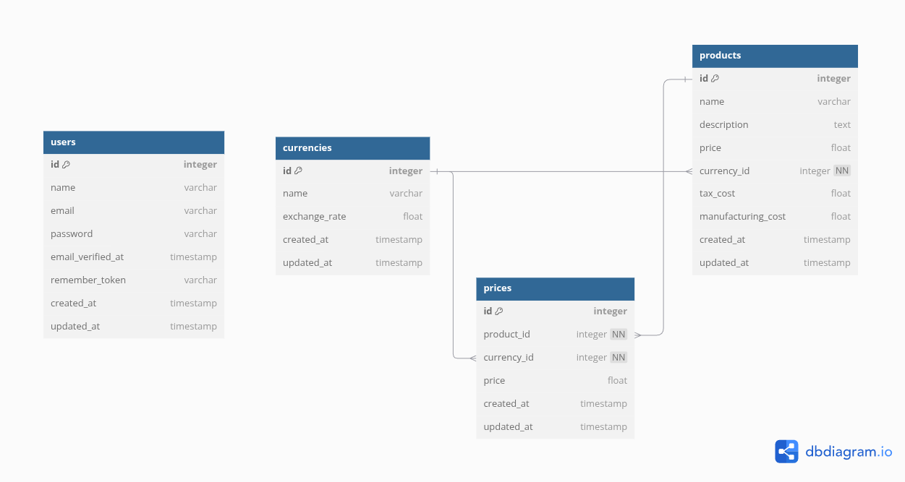

# Proyecto Ciph3r-Test

## Requisitos
Antes de comenzar, asegúrate de tener instalados los siguientes requisitos:
- PHP >= 8.1
- Composer
- Node.js >= 16.x
- NPM o Yarn
- SQLite

## Pasos para levantar el proyecto en local

### 1. Clonar el repositorio
Clona este repositorio en tu máquina local:
```bash
git clone <URL_DEL_REPOSITORIO>
```

### 2. Instalar dependencias
Accede al directorio del proyecto e instala las dependencias de PHP y JavaScript:
```bash
cd ciph3r-test
composer install
npm install
```


### 3. Generar clave de aplicación
Genera una nueva clave de aplicación para Laravel:
```bash
php artisan key:generate
```

### 4. Generar clave JWT
Genera la clave secreta para JWT, necesaria para la autenticación:
```bash
php artisan jwt:secret
```

Esto actualizará el archivo `.env` con una clave secreta en la variable `JWT_SECRET`.

### 5. Configurar el archivo .env
Copia el archivo `.env.example` a `.env` y configura las variables de entorno, especialmente la conexión a la base de datos:
```bash
cp .env.example .env
```


### 6. Crear y migrar la base de datos
Este proyecto utiliza SQLite, ejecuta las migraciones para crear las tablas necesarias:
```bash
php artisan migrate
```

### 7. Sembrar datos iniciales
Ejecuta los seeders para llenar la base de datos con datos iniciales:
```bash
php artisan db:seed
```

### 8. Compilar los activos
Compila los activos de JavaScript y CSS para el proyecto:
```bash
npm run build
```

### 9. Iniciar el servidor de desarrollo
Inicia el servidor de desarrollo de Laravel y accede a la aplicación desde tu navegador:
```bash
php artisan serve
```
Visita `http://localhost:8000` en tu navegador.

### 10. Configurar el cron job para tareas programadas (de ser necesario)
Laravel utiliza el scheduler para ejecutar tareas programadas como el Job de actualización de exchange rates y precios. Para habilitarlo, configura un cron job en tu servidor, este solo necesita ejecutar un comando de artisan para ejecutar cualquier job que programes

#### Configuración del cron job:
Ejecuta el siguiente comando para abrir el archivo de configuración de cron:
```bash
crontab -e
```

Agrega la siguiente línea al archivo de configuración de cron:
```bash
0 * * * * cd /path/to/your/project && php artisan schedule:run >> /dev/null 2>&1
```

- Reemplaza `/path/to/your/project` con la ruta completa de tu proyecto Laravel.
- Esto ejecutará el scheduler de Laravel cada minuto, y Laravel se encargará de ejecutar el Job `UpdateExchangeRatesAndPricesJob` o cualquier otro que quieras crear, según la configuración en el archivo `Kernel.php`.

- Adicionalmente puedes ejecutar jobs en la consola de tinker

```bash
php artisan tinker

```
y en la consola de tinker ejecuta

```bash

App\Jobs\UpdateExchangeRatesAndPricesJob::dispatch();
```

### Testing

#### Ejecutar las pruebas
Para ejecutar todas las pruebas del proyecto:
```bash
php artisan test
```

Para ejecutar pruebas específicas:
```bash
php artisan test --filter NombreDeLaPrueba
```

Por ejemplo:
```bash
php artisan test --filter test_store_product
```

o un set de pruebas:
```bash
php artisan test --filter ProductControllerTest
```

## Notas
Puedes ver documentación de los endppoints en  http://localhost:8000/api/documentation, si generas mas documentación, recuerda correr 
```bash
php artisan l5-swagger:generate
```

Adicionalmente en la carpeta `docs/api-clients` encontraras archivos para usar en Postman u Insomnia

### Diagrama de la base de datos

Este es el diagrama de la base de datos del proyecto:

